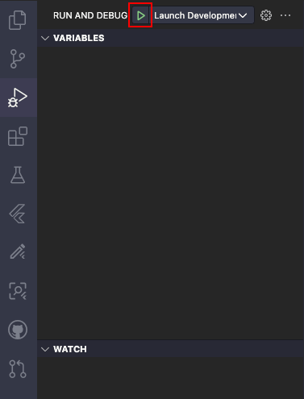

# Palm Book Test

A new Flutter project.

## Getting Started

Follow these steps to run the project in Visual Studio Code (VSCode):

#### 1. Go to the Run and Debug panel in VSCode.

#### 2. Click the Marked Area.

#### 3. Select a Run Mode.

- Launch Development: Runs the app in the development environment.
- Launch Staging: Runs the app in the staging environment.
- Launch Production: Runs the app in the production environment.

#### 4. Press the run icon.

